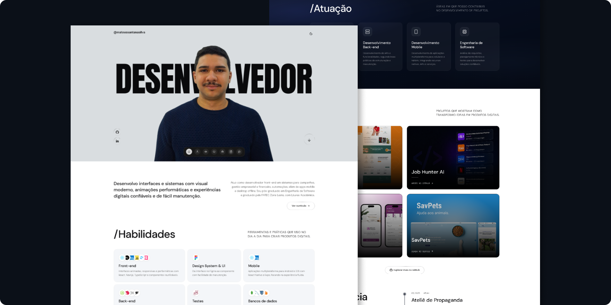

# Mateus Santana

Portfólio pessoal de **Mateus Santana**, desenvolvedor de software com foco em front-end e atuação em aplicações web, mobile e back-end.

<div align="center">
    
</div>

---

## Sobre mim

Sou desenvolvedor front-end em São Paulo (Zona Leste). Crio interfaces e sistemas com visual moderno, animações performáticas e experiências digitais confiáveis e fáceis de manter.

Hoje atuo no **Ateliê de Propaganda**, desenvolvendo e mantendo sistemas web para campanhas e promoções, gestão empresarial e financeira, automações, além de apps mobile e desktop offline.

Sou pós-graduado em **Engenharia de Software** (FAMEESP) e graduado em **Desenvolvimento de Software Multiplataforma** pela **FATEC Zona Leste**, com Láurea Acadêmica. Também tenho formação técnica em Desenvolvimento de Sistemas pela ETEC Zona Leste.

---

## Sobre este projeto

Site one-page com seções de apresentação, stack, áreas de atuação, projetos, experiência, formação e contato. Inclui tema claro/escuro, navegação flutuante e animações de scroll.

---

## Stack do site

| Camada | Tecnologias |
| --- | --- |
| UI | React 19, TypeScript, Vite |
| Estilo | Tailwind CSS 4, Base UI / shadcn |
| Animação | Motion |
| Formulário | React Hook Form, Zod |
| Qualidade | Biome / Ultracite |

---

## Como rodar

```bash
npm install
npm run dev
```

Build de produção:

```bash
npm run build
npm run preview
```

---

## Contato

- **E-mail:** [santanasilva1778@gmail.com](mailto:santanasilva1778@gmail.com)
- **WhatsApp:** [(11) 93217-8035](https://wa.me/5511932178035)
- **GitHub:** [mateussantanasilva](https://github.com/mateussantanasilva)
- **LinkedIn:** [Mateus Santana Silva](https://www.linkedin.com/in/mateus-santana-silva/)
- **Localização:** São Paulo, SP — Zona Leste
